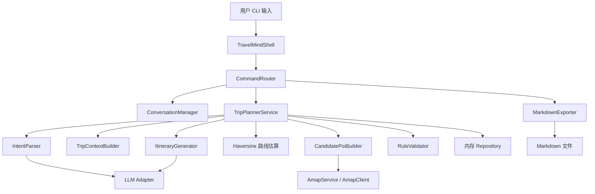

# TravelMind

TravelMind 是一个基于 Java 的命令行智能行程规划助手。用户可以像聊天一样输入旅行需求，例如“帮我规划去上海的三日旅游的行程”，系统会结合大模型、地图 POI 数据、规则校验和内存会话状态生成 Markdown 行程，并支持多轮修改和导出。

## 核心能力

- 使用 CLI 聊天窗口进行交互，支持普通自然语言输入和系统命令。
- 通过 `LlmClient` 抽象接入大模型，当前实现使用 Anthropic Messages 兼容格式。
- 接入高德地图 API 查询 POI 和地理编码信息。
- 路线距离和耗时默认使用本地 Haversine 公式估算，不调用高德路线规划。
- 使用内存仓库存储会话、需求、行程、POI 缓存和大模型调用日志。
- 支持多轮对话修改已有行程，例如“第二天不要去博物馆，换成迪士尼”。
- 支持导出当前行程为 Markdown 文件。
- 使用 `.env` 管理大模型、高德和导出目录等敏感配置。
- 无需 MySQL、Redis、前端页面，适合本地演示和面试讲解。

## 技术栈

| 方向 | 技术 | 说明 |
| --- | --- | --- |
| 语言 | Java 17+ | 项目使用 Java 17 编译目标 |
| 框架 | Spring Boot 3.3.0 | 管理配置、Bean 和应用生命周期 |
| CLI | Java Scanner | 实现轻量交互式命令行体验 |
| 大模型 | LLM Adapter | 通过 `LlmClient` 抽象接入，当前实现兼容 Anthropic Messages 格式 |
| 地图 | 高德地图 API | 查询 POI 和地理编码 |
| 路线估算 | Haversine | 本地计算两点距离和估算耗时 |
| 存储 | ConcurrentHashMap | 内存仓库，无外部数据库依赖 |
| HTTP | OkHttp | 调用大模型和高德 API |
| JSON | Jackson | 处理 LLM、地图接口和对象序列化 |
| 配置 | dotenv-java | 从 `.env` 加载敏感配置 |
| 测试 | JUnit 5 + Mockito | 单元测试和服务级流程测试 |

## 快速开始

### 1. 环境要求

请先确认本机已经安装：

```bash
java -version
mvn -version
```

推荐版本：

- Java 17 或更高版本
- Maven 3.6 或更高版本

### 2. 配置环境变量

复制示例配置：

```bash
cp .env.example .env
```

Windows PowerShell 可以使用：

```powershell
Copy-Item .env.example .env
```

编辑 `.env`，填入你的真实密钥：

```env
LLM_PROVIDER=mimo
MIMO_BASE_URL=https://token-plan-cn.xiaomimimo.com/anthropic
MIMO_CHAT_PATH=/v1/messages
MIMO_API_KEY=your_llm_api_key
MIMO_MODEL=your_model_name
MIMO_TEMPERATURE=0.4
MIMO_TIMEOUT_SECONDS=60

AMAP_API_KEY=your_amap_api_key
AMAP_BASE_URL=https://restapi.amap.com
AMAP_TIMEOUT_SECONDS=20

EXPORT_DIR=exports
```

`MIMO_*` 是当前内置大模型 adapter 沿用的配置前缀。项目业务层只依赖 `LlmClient`，如果要接入其他兼容 Anthropic Messages 格式的模型服务，可以替换 `MIMO_BASE_URL`、`MIMO_MODEL` 和 `MIMO_API_KEY`；如果协议不同，则新增一个 `LlmClient` 实现类即可。

配置说明：

| 配置项 | 必填 | 说明 |
| --- | --- | --- |
| `LLM_PROVIDER` | 是 | 大模型 provider，当前内置实现使用 `mimo` 作为配置名 |
| `MIMO_BASE_URL` | 是 | Anthropic Messages 兼容接口基础地址 |
| `MIMO_CHAT_PATH` | 是 | 对话接口路径，默认 `/v1/messages` |
| `MIMO_API_KEY` | 是 | 大模型 API Key |
| `MIMO_MODEL` | 是 | 使用的模型名称 |
| `MIMO_TEMPERATURE` | 否 | 大模型采样温度，默认 `0.4` |
| `MIMO_TIMEOUT_SECONDS` | 否 | 大模型请求超时时间 |
| `AMAP_API_KEY` | 是 | 高德地图 API Key |
| `AMAP_BASE_URL` | 否 | 高德 API 基础地址 |
| `AMAP_TIMEOUT_SECONDS` | 否 | 高德 API 请求超时时间 |
| `EXPORT_DIR` | 否 | Markdown 行程导出目录，默认 `exports` |

### 3. 运行项目

开发模式运行：

```bash
mvn spring-boot:run
```

打包后运行：

```bash
mvn clean package
java -jar target/travelmind-0.0.1-SNAPSHOT.jar
```

运行测试：

```bash
mvn test
```

完整重新编译并测试：

```bash
mvn clean test
```

## CLI 使用方式

启动后进入类似聊天窗口的交互模式：

```text
TravelMind > 帮我规划去上海的三日旅游的行程
```

系统会解析目的地、天数、偏好、人数、预算、交通方式等信息，生成 Markdown 行程。

继续输入修改需求即可触发多轮修改：

```text
TravelMind > 第二天不要去博物馆，换成迪士尼
```

导出当前行程：

```text
TravelMind > /export
```

查看历史版本：

```text
TravelMind > /history
```

常用命令：

| 命令 | 说明 |
| --- | --- |
| `/help` | 查看帮助 |
| `/new` | 创建新会话 |
| `/history` | 查看当前会话的历史行程 |
| `/export` | 将当前行程导出为 Markdown |
| `/exit` | 退出程序 |

## 项目架构

### 总体架构



### 分层说明

| 层级 | 包路径 | 职责 |
| --- | --- | --- |
| 启动层 | `com.travelmind` | Spring Boot 应用入口 |
| CLI 层 | `com.travelmind.cli` | 读取用户输入、解析命令、渲染输出 |
| 会话层 | `com.travelmind.conversation` | 管理当前会话、当前行程和历史上下文 |
| 规划层 | `com.travelmind.planner` | 编排行程生成、修改、路线估算和规则校验 |
| 大模型层 | `com.travelmind.llm` | 封装大模型适配接口、Prompt 模板和调用日志 |
| 地图层 | `com.travelmind.amap` | 封装高德 POI 搜索和地理编码 |
| 领域层 | `com.travelmind.domain` | 定义行程、天计划、活动、POI、路线等模型 |
| 存储层 | `com.travelmind.storage` | 使用内存仓库存储业务状态 |
| 导出层 | `com.travelmind.export` | 将行程导出为 Markdown 文件 |
| 配置层 | `com.travelmind.config` | 加载 `.env`，配置 Jackson |

### 目录结构

```text
travelmind
├── src
│   ├── main
│   │   ├── java
│   │   │   └── com
│   │   │       └── travelmind
│   │   │           ├── TravelMindApplication.java
│   │   │           ├── amap
│   │   │           │   ├── AmapClient.java
│   │   │           │   ├── AmapProperties.java
│   │   │           │   ├── AmapService.java
│   │   │           │   ├── dto
│   │   │           │   │   └── AmapPoi.java
│   │   │           │   └── impl
│   │   │           │       └── AmapServiceImpl.java
│   │   │           ├── cli
│   │   │           │   ├── CliRenderer.java
│   │   │           │   ├── CommandRouter.java
│   │   │           │   ├── ShellCommand.java
│   │   │           │   └── TravelMindShell.java
│   │   │           ├── config
│   │   │           │   ├── DotenvInitializer.java
│   │   │           │   └── JacksonConfig.java
│   │   │           ├── conversation
│   │   │           │   ├── ConversationContext.java
│   │   │           │   ├── ConversationIntent.java
│   │   │           │   ├── ConversationManager.java
│   │   │           │   └── UserMessageClassifier.java
│   │   │           ├── domain
│   │   │           │   ├── Activity.java
│   │   │           │   ├── DayPlan.java
│   │   │           │   ├── Itinerary.java
│   │   │           │   ├── Poi.java
│   │   │           │   ├── RouteInfo.java
│   │   │           │   └── TripRequest.java
│   │   │           ├── export
│   │   │           │   ├── ExportProperties.java
│   │   │           │   └── MarkdownExporter.java
│   │   │           ├── llm
│   │   │           │   ├── LlmClient.java
│   │   │           │   ├── LlmClientFactory.java
│   │   │           │   ├── LlmProperties.java
│   │   │           │   ├── LlmRequest.java
│   │   │           │   ├── LlmResponse.java
│   │   │           │   ├── PromptTemplates.java
│   │   │           │   └── mimo
│   │   │           │       └── MimoLlmClient.java
│   │   │           ├── planner
│   │   │           │   ├── CandidatePoiBuilder.java
│   │   │           │   ├── IntentParser.java
│   │   │           │   ├── ItineraryGenerator.java
│   │   │           │   ├── RuleValidator.java
│   │   │           │   ├── TripContext.java
│   │   │           │   ├── TripContextBuilder.java
│   │   │           │   ├── TripPlannerService.java
│   │   │           │   └── impl
│   │   │           │       ├── IntentParserImpl.java
│   │   │           │       └── TripPlannerServiceImpl.java
│   │   │           └── storage
│   │   │               ├── ItineraryRepository.java
│   │   │               ├── LlmCallLogRepository.java
│   │   │               ├── PoiCacheRepository.java
│   │   │               ├── TravelSessionRepository.java
│   │   │               └── TripRequestRepository.java
│   │   └── resources
│   │       └── application.yml
│   └── test
│       └── java
│           └── com
│               └── travelmind
├── .env.example
├── .gitignore
├── pom.xml
└── README.md
```

## 核心流程

### 新建行程

1. 用户在 CLI 输入自然语言需求。
2. `CommandRouter` 判断这是普通输入，不是系统命令。
3. `TripPlannerServiceImpl.handleUserMessage` 构建当前会话上下文。
4. `IntentParserImpl` 通过 `LlmClient` 调用大模型解析用户意图，得到目的地、天数、偏好等结构化信息。
5. 如果目的地或天数缺失，系统返回追问内容，不覆盖当前已有行程。
6. `TripContextBuilder` 补齐默认人数、预算、节奏、交通方式等字段。
7. `CandidatePoiBuilder` 通过高德地图查询候选 POI，并写入 POI 缓存。
8. `TripPlannerServiceImpl` 使用 Haversine 公式估算相邻 POI 的距离和耗时。
9. `ItineraryGenerator` 通过 `LlmClient` 调用大模型生成 Markdown 行程。
10. `RuleValidator` 做基础规则校验，例如天数、活动结构、提醒信息等。
11. 内存仓库保存 `TripRequest`、`Itinerary`，并更新当前会话的当前行程 ID。

### 修改行程

1. 用户继续输入修改指令。
2. 系统从 `TravelSessionRepository` 找到当前行程 ID。
3. `ConversationManager` 和 `TripPlannerServiceImpl` 根据 `requestId` 恢复原始旅行需求。
4. `ItineraryGenerator.modify` 把当前 Markdown、修改要求、相关 POI 一起交给大模型。
5. 系统生成新版本行程，并保存为新的 `Itinerary`。
6. 当前会话指向新版本，旧版本仍可通过 `/history` 查看。

### 导出行程

1. 用户输入 `/export`。
2. `CommandRouter` 获取当前会话的最新行程。
3. `MarkdownExporter` 根据目的地、天数和时间生成文件名。
4. 文件写入 `EXPORT_DIR` 指定目录。

导出文件名示例：

```text
travelmind-上海-3days-202606122315.md
```

## 关键设计说明

### 为什么使用内存存储

这个项目是面试展示项目，核心目标是讲清楚“大模型智能生成 + 地图数据 + 多轮对话 + 工程化编排”。使用内存存储可以减少 MySQL 配置成本，让项目更容易本地运行。

当前内存仓库包括：

| 仓库 | 作用 |
| --- | --- |
| `TravelSessionRepository` | 保存会话和当前行程 ID |
| `TripRequestRepository` | 保存用户旅行需求 |
| `ItineraryRepository` | 保存行程 Markdown、版本和关联需求 |
| `PoiCacheRepository` | 缓存高德 POI 查询结果 |
| `LlmCallLogRepository` | 记录大模型调用信息 |

注意：内存数据会在应用重启后丢失，这是 MVP 阶段的设计取舍。

### 为什么路线估算使用 Haversine

高德地图在本项目中主要用于查询真实 POI 和地理编码。路线距离和耗时估算默认在本地完成：

1. 使用两个 POI 的经纬度计算直线距离。
2. 将直线距离乘以 `1.3`，近似真实道路距离。
3. 根据交通方式设置平均速度，估算耗时。

这样可以减少外部 API 调用次数，避免路线规划接口配额、权限和响应结构对演示流程造成影响。

### 大模型职责边界

大模型主要负责两件事：

1. 理解自然语言需求，输出结构化意图。
2. 根据上下文生成或修改 Markdown 行程。

Java 服务负责：

- 会话状态管理
- 参数默认值补全
- 地图 POI 查询
- 路线估算
- 版本保存
- 导出文件
- 规则校验
- 异常处理

这样的分工可以避免“大模型黑盒控制整个系统”，更符合工程化项目的设计思路。

## 测试

当前测试覆盖：

- 用户消息分类
- Markdown 导出
- 规则校验
- 上下文默认值补全
- LLM 客户端工厂
- 行程规划服务主流程
- 追问不清空当前行程
- 修改行程生成新版本
- Spring Boot 上下文启动

运行：

```bash
mvn clean test
```

最近一次验证结果：

```text
Tests run: 52, Failures: 0, Errors: 0, Skipped: 0
```
