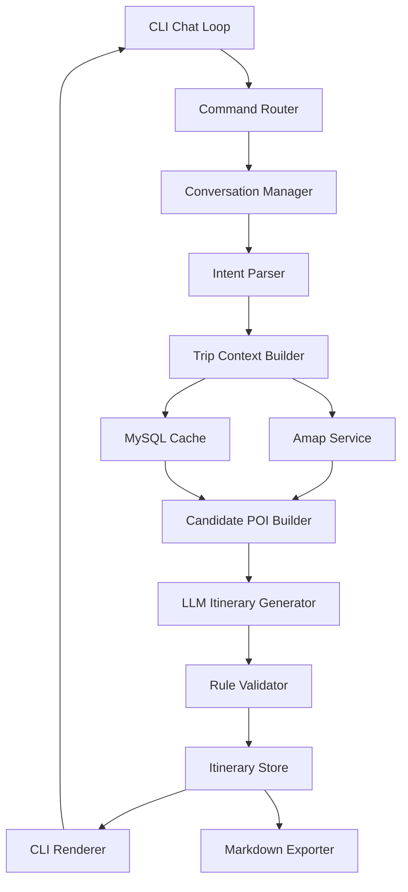

# travelmind 系统架构设计文档

## 1. 文档说明

本文档用于描述 `travelmind` 项目的系统架构、技术选型、核心模块、业务流程、数据模型、外部服务接入方式、异常处理策略以及后续扩展方向。

`travelmind` 是一个面向面试展示的 Java CLI 智能行程规划项目。项目重点不是做复杂前端，而是通过命令行聊天交互完成完整业务闭环：用户输入自然语言旅行需求，系统通过大模型理解意图，结合高德地图 API 获取真实地点信息，生成可修改、可保存、可导出的 Markdown 行程方案。

## 2. 项目背景

传统行程规划工具通常需要用户手动填写目的地、出行天数、偏好、预算、交通方式等信息，使用门槛较高。大模型具备较好的自然语言理解和内容生成能力，可以帮助用户从一句模糊需求中快速生成初版行程。

但是，单纯依赖大模型也存在明显问题：

- 容易生成不存在或不准确的地点信息。
- 可能忽略真实交通距离和路线耗时。
- 对用户多轮修改的状态管理不稳定。
- 缺少工程化的持久化、日志、导出和异常处理能力。

因此，`travelmind` 采用“大模型 + 地图 API + Java 规则校验 + MySQL 持久化”的组合架构。大模型负责理解和生成，Java 系统负责状态、工具调用、数据落库和基本约束校验。

## 3. 项目定位

### 3.1 项目名称

```text
travelmind
```

### 3.2 一句话介绍

```text
travelmind 是一个基于 Java 的交互式命令行智能行程规划助手，支持用户用自然语言提出旅行需求，通过可配置大模型和高德地图 API 生成可修改、可保存、可导出的 Markdown 行程。
```

### 3.3 典型输入

```text
帮我规划去上海的三日旅游的行程
```

### 3.4 典型输出

```text
我先按第一次去上海、三天两晚、公共交通为主、节奏适中来安排。

# 上海三日游行程

## 第 1 天：经典上海与城市夜景

- 上午：人民广场、上海博物馆
- 中午：南京东路附近用餐
- 下午：南京东路步行街、外滩
- 晚上：陆家嘴、东方明珠周边夜景

...
```

## 4. 项目目标

### 4.1 核心目标

- 支持类似聊天窗口的 CLI 交互。
- 支持用户使用自然语言描述旅行需求。
- 支持小米 MiMo 大模型作为默认模型。
- 支持通过配置切换不同大模型供应商。
- 支持接入高德地图 API 查询 POI 和路线信息。
- 支持全国城市的行程规划。
- 支持多轮对话修改已有行程。
- 支持 MySQL 保存会话、需求、行程、缓存和调用日志。
- 支持将最终行程导出为 Markdown 文件。
- 支持通过 `.env` 管理敏感配置。

### 4.2 非目标

MVP 阶段不做以下能力：

- 不做 Web 前端页面。
- 不做移动端应用。
- 不做用户登录和权限系统。
- 不做酒店、机票、火车票实时比价。
- 不做支付和订单系统。
- 不做 PDF、Word 导出。
- 不做复杂商业推荐排序模型。

## 5. 使用场景

### 5.1 新建行程

用户输入：

```text
帮我规划去上海的三日旅游的行程
```

系统行为：

1. 识别目的地为上海。
2. 识别天数为 3 天。
3. 缺失预算、人数、交通方式、偏好时使用默认值。
4. 调用高德地图 API 查询上海相关景点和区域。
5. 调用大模型生成三日行程。
6. 保存行程并在 CLI 展示。

### 5.2 多轮修改

用户输入：

```text
第二天不要安排博物馆，换成迪士尼
```

系统行为：

1. 判断该输入是对当前行程的修改。
2. 从会话上下文中找到当前行程。
3. 识别修改目标为第 2 天。
4. 识别替换地点为迪士尼。
5. 查询迪士尼相关 POI 和路线信息。
6. 重新生成或局部修改第 2 天行程。
7. 保留第 1 天和第 3 天内容。
8. 保存新版本行程。

### 5.3 导出行程

用户输入：

```text
/export
```

系统行为：

1. 获取当前会话中的最新行程。
2. 生成 Markdown 文件。
3. 输出文件保存路径。

## 6. 技术选型

| 技术方向 | 选型 | 说明 |
| --- | --- | --- |
| 编程语言 | Java 17 | 语法稳定，适合 Spring Boot 3.x |
| 应用框架 | Spring Boot 3.x | 管理依赖、配置、Bean 和应用生命周期 |
| CLI 交互 | JLine | 实现类似聊天窗口的命令行输入体验 |
| 数据库 | MySQL 8.x | 保存会话、行程、缓存和日志 |
| ORM | MyBatis Plus | 降低 CRUD 开发成本，适合面试项目展示 |
| HTTP 客户端 | OkHttp 或 WebClient | 调用大模型和高德地图 API |
| JSON 处理 | Jackson | 处理大模型和地图 API 的 JSON 数据 |
| 环境变量 | dotenv-java | 从 `.env` 读取敏感配置 |
| 大模型 | 小米 MiMo | 作为默认大模型供应商 |
| 地图服务 | 高德地图 API | 查询 POI、地理编码、路线和距离 |
| 导出格式 | Markdown | 实现简单，输出结果清晰可读 |
| 测试框架 | JUnit 5 + Mockito | 单元测试和外部依赖 Mock |

## 7. 总体架构

### 7.1 架构图



### 7.2 分层说明

项目采用经典分层结构：

```text
CLI 层
负责命令行输入输出、命令识别和展示。

应用层
负责编排一次行程规划或行程修改的完整流程。

领域层
定义 TripRequest、Itinerary、DayPlan、Activity、Poi 等核心模型。

基础设施层
负责大模型调用、高德地图调用、MySQL 持久化、文件导出等外部能力。
```

### 7.3 设计原则

- 大模型只负责智能理解和内容生成，不直接掌控系统状态。
- 地图 API 提供真实地点和距离约束，减少大模型幻觉。
- Java 代码负责流程编排、数据保存、异常处理和基础规则校验。
- 敏感信息全部放入 `.env`，不提交到 Git。
- MVP 阶段控制复杂度，保证项目可完成、可演示、可讲清楚。

## 8. 项目目录结构

建议目录结构如下：

```text
travelmind
├── docs
│   └── travelmind-system-architecture.md
├── src
│   ├── main
│   │   ├── java
│   │   │   └── com
│   │   │       └── travelmind
│   │   │           ├── TravelMindApplication.java
│   │   │           ├── cli
│   │   │           │   ├── TravelMindShell.java
│   │   │           │   ├── CommandRouter.java
│   │   │           │   └── CliRenderer.java
│   │   │           ├── conversation
│   │   │           │   ├── ConversationManager.java
│   │   │           │   ├── ConversationContext.java
│   │   │           │   └── ConversationIntent.java
│   │   │           ├── planner
│   │   │           │   ├── TripPlannerService.java
│   │   │           │   ├── IntentParser.java
│   │   │           │   ├── TripContextBuilder.java
│   │   │           │   ├── CandidatePoiBuilder.java
│   │   │           │   ├── ItineraryGenerator.java
│   │   │           │   └── RuleValidator.java
│   │   │           ├── llm
│   │   │           │   ├── LlmClient.java
│   │   │           │   ├── MimoLlmClient.java
│   │   │           │   ├── LlmProviderFactory.java
│   │   │           │   ├── LlmRequest.java
│   │   │           │   └── LlmResponse.java
│   │   │           ├── amap
│   │   │           │   ├── AmapService.java
│   │   │           │   ├── AmapPoiClient.java
│   │   │           │   ├── AmapRouteClient.java
│   │   │           │   └── AmapProperties.java
│   │   │           ├── domain
│   │   │           │   ├── TripRequest.java
│   │   │           │   ├── Itinerary.java
│   │   │           │   ├── DayPlan.java
│   │   │           │   ├── Activity.java
│   │   │           │   ├── Poi.java
│   │   │           │   └── RouteInfo.java
│   │   │           ├── repository
│   │   │           │   ├── TravelSessionMapper.java
│   │   │           │   ├── TripRequestMapper.java
│   │   │           │   ├── ItineraryMapper.java
│   │   │           │   ├── PoiCacheMapper.java
│   │   │           │   └── LlmCallLogMapper.java
│   │   │           ├── entity
│   │   │           │   ├── TravelSessionEntity.java
│   │   │           │   ├── TripRequestEntity.java
│   │   │           │   ├── ItineraryEntity.java
│   │   │           │   ├── PoiCacheEntity.java
│   │   │           │   └── LlmCallLogEntity.java
│   │   │           ├── export
│   │   │           │   └── MarkdownExporter.java
│   │   │           └── config
│   │   │               ├── DotenvConfig.java
│   │   │               ├── LlmProperties.java
│   │   │               └── MybatisPlusConfig.java
│   │   └── resources
│   │       ├── application.yml
│   │       └── mapper
│   └── test
│       └── java
├── .env.example
├── .gitignore
├── pom.xml
└── README.md
```

## 9. 核心模块设计

### 9.1 CLI 模块

包路径：

```text
com.travelmind.cli
```

职责：

- 启动交互式命令行。
- 接收用户输入。
- 区分系统命令和普通自然语言输入。
- 渲染行程结果、错误信息和提示信息。

支持命令：

| 命令 | 说明 |
| --- | --- |
| `/help` | 查看帮助 |
| `/new` | 开始新行程 |
| `/export` | 导出当前行程为 Markdown |
| `/history` | 查看历史行程 |
| `/exit` | 退出程序 |

示例交互：

```text
TravelMind > 帮我规划去上海的三日旅游的行程

TravelMind > 第二天不要去博物馆，换成迪士尼

TravelMind > /export

TravelMind > /exit
```

### 9.2 Conversation 模块

包路径：

```text
com.travelmind.conversation
```

职责：

- 管理当前 CLI 会话。
- 保存当前行程上下文。
- 判断用户输入是新规划、修改行程还是系统命令。
- 维护多轮对话状态。

核心对象：

```text
ConversationContext
保存 sessionId、currentTripRequest、currentItinerary、historyMessages 等。

ConversationManager
负责创建、读取、更新和清理会话上下文。

ConversationIntent
表示用户输入类型，例如 NEW_PLAN、MODIFY_PLAN、EXPORT、UNKNOWN。
```

### 9.3 LLM 模块

包路径：

```text
com.travelmind.llm
```

职责：

- 封装大模型调用。
- 默认接入小米 MiMo。
- 提供统一接口，便于后续切换其他大模型。
- 记录调用日志，便于排查问题。

接口设计：

```java
public interface LlmClient {
    LlmResponse chat(LlmRequest request);
}
```

默认实现：

```text
MimoLlmClient
调用小米 MiMo API。
```

可扩展实现：

```text
OpenAiCompatibleLlmClient
TongyiLlmClient
DeepSeekLlmClient
```

大模型主要用于：

- 意图解析。
- 行程生成。
- 行程局部修改。
- Markdown 文案生成。

### 9.4 Amap 模块

包路径：

```text
com.travelmind.amap
```

职责：

- 封装高德地图 API。
- 查询城市地点和 POI。
- 查询地址经纬度。
- 查询路线距离和耗时。
- 将结果写入 POI 缓存。

核心能力：

```text
searchPoi(city, keyword)
根据城市和关键词搜索地点。

geocode(address)
将地址转换为经纬度。

estimateRoute(origin, destination, mode)
估算两个地点之间的路线耗时和距离。
```

高德地图 API Key 从 `.env` 中读取：

```env
AMAP_API_KEY=your_amap_api_key
```

### 9.5 Planner 模块

包路径：

```text
com.travelmind.planner
```

职责：

- 编排一次完整行程规划流程。
- 合并用户输入、上下文、地图数据和缓存数据。
- 构建候选景点列表。
- 调用大模型生成行程。
- 调用规则校验模块进行兜底。

核心类：

```text
TripPlannerService
行程规划总入口。

IntentParser
调用大模型解析用户意图。

TripContextBuilder
补全默认值并构建规划上下文。

CandidatePoiBuilder
基于高德地图结果和缓存数据构建候选 POI。

ItineraryGenerator
调用大模型生成行程。

RuleValidator
做基础规则校验。
```

### 9.6 Export 模块

包路径：

```text
com.travelmind.export
```

职责：

- 将当前行程导出成 Markdown 文件。
- 生成统一、可阅读、可提交的文档格式。
- 保存到本地指定目录。

导出文件命名规则：

```text
travelmind-{city}-{days}days-{yyyyMMddHHmm}.md
```

示例：

```text
travelmind-shanghai-3days-202606121530.md
```

## 10. 核心领域模型

### 10.1 TripRequest

表示用户结构化后的行程需求。

```java
public class TripRequest {
    private String destination;
    private Integer durationDays;
    private LocalDate startDate;
    private Integer peopleCount;
    private String budgetLevel;
    private String paceLevel;
    private String transportMode;
    private List<String> preferences;
    private String hotelArea;
    private String rawInput;
}
```

字段说明：

| 字段 | 说明 |
| --- | --- |
| destination | 目的地城市，例如上海 |
| durationDays | 出行天数 |
| startDate | 出发日期，可为空 |
| peopleCount | 出行人数，可为空 |
| budgetLevel | 预算等级，例如经济、舒适、高预算 |
| paceLevel | 节奏，例如轻松、适中、紧凑 |
| transportMode | 交通方式，例如公共交通、打车、自驾 |
| preferences | 兴趣偏好，例如美食、亲子、历史文化 |
| hotelArea | 住宿区域，可为空 |
| rawInput | 用户原始输入 |

### 10.2 Poi

表示景点、餐厅、商圈、车站等地点信息。

```java
public class Poi {
    private String source;
    private String sourceId;
    private String name;
    private String city;
    private String address;
    private BigDecimal latitude;
    private BigDecimal longitude;
    private String category;
    private List<String> tags;
    private Integer recommendedStayMinutes;
}
```

### 10.3 RouteInfo

表示两个地点之间的路线信息。

```java
public class RouteInfo {
    private String originName;
    private String destinationName;
    private Integer distanceMeters;
    private Integer durationMinutes;
    private String transportMode;
}
```

### 10.4 Itinerary

表示完整行程。

```java
public class Itinerary {
    private Long id;
    private Long sessionId;
    private TripRequest request;
    private List<DayPlan> days;
    private List<String> assumptions;
    private List<String> reminders;
    private List<String> alternatives;
    private String markdown;
}
```

### 10.5 DayPlan

表示一天的安排。

```java
public class DayPlan {
    private Integer dayIndex;
    private String theme;
    private List<Activity> activities;
    private Integer totalVisitMinutes;
    private Integer totalTransportMinutes;
}
```

### 10.6 Activity

表示具体活动。

```java
public class Activity {
    private String timeSlot;
    private String title;
    private String locationName;
    private Integer stayMinutes;
    private String transportSuggestion;
    private String reason;
    private List<String> tips;
}
```

## 11. 数据库设计

MVP 阶段使用 5 张表，保证功能完整但复杂度可控。

### 11.1 travel_session

保存一次 CLI 对话会话。

```sql
CREATE TABLE travel_session (
    id BIGINT PRIMARY KEY AUTO_INCREMENT,
    session_name VARCHAR(128) NOT NULL,
    status VARCHAR(32) NOT NULL DEFAULT 'ACTIVE',
    current_itinerary_id BIGINT NULL,
    created_at DATETIME NOT NULL DEFAULT CURRENT_TIMESTAMP,
    updated_at DATETIME NOT NULL DEFAULT CURRENT_TIMESTAMP ON UPDATE CURRENT_TIMESTAMP
);
```

字段说明：

| 字段 | 说明 |
| --- | --- |
| id | 会话 ID |
| session_name | 会话名称 |
| status | 会话状态 |
| current_itinerary_id | 当前最新行程 ID |
| created_at | 创建时间 |
| updated_at | 更新时间 |

### 11.2 trip_request

保存结构化后的用户旅行需求。

```sql
CREATE TABLE trip_request (
    id BIGINT PRIMARY KEY AUTO_INCREMENT,
    session_id BIGINT NOT NULL,
    raw_input TEXT NOT NULL,
    destination VARCHAR(64) NOT NULL,
    duration_days INT NOT NULL,
    start_date DATE NULL,
    people_count INT NULL,
    budget_level VARCHAR(32) NULL,
    pace_level VARCHAR(32) NULL,
    transport_mode VARCHAR(32) NULL,
    preferences_json JSON NULL,
    hotel_area VARCHAR(128) NULL,
    created_at DATETIME NOT NULL DEFAULT CURRENT_TIMESTAMP,
    updated_at DATETIME NOT NULL DEFAULT CURRENT_TIMESTAMP ON UPDATE CURRENT_TIMESTAMP,
    INDEX idx_trip_request_session_id (session_id),
    INDEX idx_trip_request_destination (destination)
);
```

### 11.3 itinerary

保存完整行程 JSON、Markdown 内容和版本信息。

```sql
CREATE TABLE itinerary (
    id BIGINT PRIMARY KEY AUTO_INCREMENT,
    session_id BIGINT NOT NULL,
    request_id BIGINT NOT NULL,
    version INT NOT NULL DEFAULT 1,
    title VARCHAR(256) NOT NULL,
    itinerary_json JSON NOT NULL,
    markdown_content MEDIUMTEXT NOT NULL,
    validation_status VARCHAR(32) NOT NULL DEFAULT 'PASSED',
    created_at DATETIME NOT NULL DEFAULT CURRENT_TIMESTAMP,
    updated_at DATETIME NOT NULL DEFAULT CURRENT_TIMESTAMP ON UPDATE CURRENT_TIMESTAMP,
    INDEX idx_itinerary_session_id (session_id),
    INDEX idx_itinerary_request_id (request_id)
);
```

设计说明：

- 行程主体使用 JSON 保存，减少表结构复杂度。
- Markdown 内容单独保存，方便 `/export` 时直接导出。
- version 用于记录多轮修改后的不同版本。

### 11.4 poi_cache

缓存高德地图返回的 POI 数据。

```sql
CREATE TABLE poi_cache (
    id BIGINT PRIMARY KEY AUTO_INCREMENT,
    source VARCHAR(32) NOT NULL DEFAULT 'AMAP',
    source_poi_id VARCHAR(128) NOT NULL,
    name VARCHAR(256) NOT NULL,
    city VARCHAR(64) NOT NULL,
    address VARCHAR(512) NULL,
    location VARCHAR(64) NULL,
    category VARCHAR(128) NULL,
    raw_json JSON NOT NULL,
    created_at DATETIME NOT NULL DEFAULT CURRENT_TIMESTAMP,
    updated_at DATETIME NOT NULL DEFAULT CURRENT_TIMESTAMP ON UPDATE CURRENT_TIMESTAMP,
    UNIQUE KEY uk_source_poi_id (source, source_poi_id),
    INDEX idx_poi_city_name (city, name)
);
```

### 11.5 llm_call_log

记录大模型调用日志。

```sql
CREATE TABLE llm_call_log (
    id BIGINT PRIMARY KEY AUTO_INCREMENT,
    session_id BIGINT NULL,
    provider VARCHAR(64) NOT NULL,
    model VARCHAR(128) NOT NULL,
    call_type VARCHAR(64) NOT NULL,
    prompt_tokens INT NULL,
    completion_tokens INT NULL,
    latency_ms INT NULL,
    status VARCHAR(32) NOT NULL,
    error_message TEXT NULL,
    request_json JSON NULL,
    response_json JSON NULL,
    created_at DATETIME NOT NULL DEFAULT CURRENT_TIMESTAMP,
    INDEX idx_llm_call_log_session_id (session_id),
    INDEX idx_llm_call_log_call_type (call_type),
    INDEX idx_llm_call_log_created_at (created_at)
);
```

调用类型示例：

```text
INTENT_PARSE
ITINERARY_GENERATE
ITINERARY_MODIFY
MARKDOWN_POLISH
```

## 12. 配置设计

### 12.1 .env

真实 `.env` 文件不提交到代码仓库。

```env
MYSQL_HOST=localhost
MYSQL_PORT=3306
MYSQL_DATABASE=travelmind
MYSQL_USERNAME=root
MYSQL_PASSWORD=your_password

LLM_PROVIDER=mimo
MIMO_BASE_URL=your_mimo_base_url
MIMO_API_KEY=your_mimo_api_key
MIMO_MODEL=your_mimo_model

AMAP_API_KEY=your_amap_api_key

EXPORT_DIR=exports
```

### 12.2 .env.example

仓库中提交 `.env.example`，用于说明需要哪些配置。

```env
MYSQL_HOST=localhost
MYSQL_PORT=3306
MYSQL_DATABASE=travelmind
MYSQL_USERNAME=root
MYSQL_PASSWORD=

LLM_PROVIDER=mimo
MIMO_BASE_URL=
MIMO_API_KEY=
MIMO_MODEL=

AMAP_API_KEY=

EXPORT_DIR=exports
```

### 12.3 .gitignore

```gitignore
.env
target/
logs/
exports/
*.log
```

### 12.4 application.yml

`application.yml` 只写非敏感配置或环境变量引用。

```yaml
spring:
  application:
    name: travelmind
  datasource:
    url: jdbc:mysql://${MYSQL_HOST:localhost}:${MYSQL_PORT:3306}/${MYSQL_DATABASE:travelmind}?useUnicode=true&characterEncoding=utf8&serverTimezone=Asia/Shanghai
    username: ${MYSQL_USERNAME:root}
    password: ${MYSQL_PASSWORD:}

travelmind:
  llm:
    provider: ${LLM_PROVIDER:mimo}
    mimo:
      base-url: ${MIMO_BASE_URL:}
      api-key: ${MIMO_API_KEY:}
      model: ${MIMO_MODEL:}
  amap:
    api-key: ${AMAP_API_KEY:}
  export:
    dir: ${EXPORT_DIR:exports}
```

## 13. 大模型接入设计

### 13.1 Provider 抽象

系统不把代码写死到某一个模型供应商，而是通过统一接口封装。

```java
public interface LlmClient {
    LlmResponse chat(LlmRequest request);
}
```

默认使用：

```text
MimoLlmClient
```

后续可扩展：

```text
OpenAiCompatibleLlmClient
DeepSeekLlmClient
TongyiLlmClient
```

### 13.2 意图解析 Prompt

输入：

```text
帮我规划去上海的三日旅游的行程
```

期望输出 JSON：

```json
{
  "intent": "NEW_PLAN",
  "destination": "上海",
  "durationDays": 3,
  "startDate": null,
  "peopleCount": null,
  "budgetLevel": null,
  "paceLevel": null,
  "transportMode": null,
  "preferences": [],
  "needClarification": false,
  "questions": []
}
```

解析规则：

- 目的地和天数是核心字段。
- 如果目的地或天数缺失，可以追问。
- 如果预算、人数、节奏缺失，优先使用默认值。
- 输出必须是 JSON，方便 Java 解析。

### 13.3 行程生成 Prompt

输入内容包括：

- 结构化 TripRequest。
- 高德地图查询到的候选 POI。
- 路线距离和耗时。
- 默认规划策略。
- 当前会话上下文。

生成要求：

- 按天输出。
- 每天包含上午、中午、下午、晚上。
- 每天给出主题。
- 给出交通建议。
- 给出用餐区域建议。
- 给出注意事项。
- 输出 Markdown。
- 避免安排过满。
- 不要编造候选列表之外的具体地点，除非明确标记为“可选建议”。

### 13.4 多轮修改 Prompt

用户输入：

```text
第二天不要去博物馆，换成迪士尼
```

输入给大模型的上下文：

- 当前完整行程。
- 用户修改要求。
- 新查询到的迪士尼 POI 信息。

生成要求：

- 只修改受影响的日期。
- 保留其他日期安排。
- 输出新的完整 Markdown。
- 给出修改说明。

## 14. 高德地图接入设计

### 14.1 使用能力

MVP 阶段使用高德地图以下能力：

- 关键字搜索 POI。
- 地理编码。
- 路线规划或距离估算。

### 14.2 POI 搜索策略

根据用户目的地和偏好构造关键词：

```text
目的地：上海
关键词：景点、美食、博物馆、步行街、夜景、亲子
```

搜索流程：

1. 查询通用热门景点。
2. 根据用户偏好查询补充 POI。
3. 对返回结果去重。
4. 写入 `poi_cache`。
5. 传给大模型作为候选地点。

### 14.3 缓存策略

优先从 `poi_cache` 查询：

```text
city = 上海 AND name LIKE '%外滩%'
```

如果缓存不存在或过期，再调用高德地图 API。

缓存优势：

- 减少 API 调用成本。
- 提高重复规划速度。
- 面试时可以体现工程优化意识。

## 15. 行程规划策略

### 15.1 默认假设

当用户没有提供完整信息时，系统使用默认值：

| 字段 | 默认值 |
| --- | --- |
| 人数 | 1-2 人 |
| 预算 | 舒适型 |
| 节奏 | 适中 |
| 交通方式 | 公共交通 + 步行 |
| 兴趣偏好 | 第一次到访经典路线 |
| 每天活动数 | 3-5 个 |
| 每天总时长 | 8-10 小时 |

### 15.2 候选 POI 构建

候选 POI 来源：

- 高德地图搜索结果。
- MySQL 缓存结果。
- 用户明确提到的地点。

候选 POI 需要包含：

- 名称。
- 城市。
- 地址。
- 经纬度。
- 类型。
- 来源。

### 15.3 生成策略

行程生成遵循以下原则：

- 同一天尽量安排地理位置相近的地点。
- 夜景类地点优先安排在晚上。
- 博物馆等室内地点可以作为雨天友好选项。
- 主题乐园类地点一般单独安排半天或一天。
- 每天保留午餐、晚餐和休息时间。
- 不把所有热门景点机械塞满。

### 15.4 规则校验

`RuleValidator` 进行基础兜底校验：

| 校验项 | 规则 |
| --- | --- |
| 每日活动数量 | 不建议超过 5 个核心活动 |
| 每日总时长 | 不建议超过 10 小时 |
| 午餐晚餐 | 每天应有用餐安排或用餐区域建议 |
| 交通耗时 | 单段通勤过长时提示 |
| 高体力活动 | 避免连续安排过多 |
| 主题乐园 | 不建议和多个跨区景点挤在同一天 |

校验失败处理：

- 轻微问题：添加提醒。
- 中等问题：自动删减或调整。
- 严重问题：要求大模型重新生成。

## 16. 多轮对话设计

### 16.1 状态保存

每次 CLI 启动后维护一个 `ConversationContext`：

```json
{
  "sessionId": 1001,
  "currentItineraryId": 2001,
  "destination": "上海",
  "durationDays": 3,
  "lastUserMessage": "第二天不要去博物馆，换成迪士尼"
}
```

### 16.2 输入类型判断

用户输入分为：

```text
NEW_PLAN
新建行程。

MODIFY_PLAN
修改已有行程。

EXPORT
导出行程。

SYSTEM_COMMAND
系统命令。

UNKNOWN
无法识别，需要追问。
```

### 16.3 修改策略

修改流程：

1. 识别修改目标。
2. 查找当前行程。
3. 补充新地点地图信息。
4. 调用大模型局部重写。
5. 生成新版本行程。
6. 更新 `travel_session.current_itinerary_id`。

版本策略：

- 不覆盖旧行程。
- 每次修改生成新版本。
- 方便 `/history` 查看历史。

## 17. Markdown 导出设计

### 17.1 导出内容结构

Markdown 文件包含：

```text
# 城市 N 日游行程

## 规划假设

## 行程总览

## 第 1 天：主题

### 上午

### 中午

### 下午

### 晚上

## 第 2 天：主题

## 交通建议

## 用餐建议

## 预约与注意事项

## 备选方案
```

### 17.2 导出路径

默认导出到：

```text
exports/
```

示例：

```text
exports/travelmind-shanghai-3days-202606121530.md
```

### 17.3 导出失败处理

可能失败原因：

- 导出目录不存在。
- 文件无写入权限。
- Markdown 内容为空。

处理方式：

- 自动创建导出目录。
- 提示用户具体错误。
- 记录日志。

## 18. 异常处理设计

### 18.1 大模型调用失败

场景：

- API Key 错误。
- 请求超时。
- 模型服务不可用。
- 返回内容不是合法 JSON。

处理方式：

- 记录 `llm_call_log`。
- CLI 输出友好提示。
- 对意图解析可尝试一次重试。
- 对 JSON 解析失败可要求模型重新输出 JSON。

### 18.2 高德地图调用失败

场景：

- API Key 缺失。
- 配额不足。
- 网络异常。
- 没有查询到 POI。

处理方式：

- 优先读取 `poi_cache`。
- 如果没有缓存，提示地图信息不可用。
- 可以降级为大模型通用规划，但明确提示“未使用实时地图结果”。

### 18.3 数据库异常

场景：

- MySQL 未启动。
- 连接配置错误。
- 写入失败。

处理方式：

- CLI 仍可展示当前行程。
- 提示用户保存失败。
- 记录日志。

### 18.4 用户输入不完整

场景：

```text
帮我规划一个旅游
```

处理方式：

- 如果缺少目的地，必须追问。
- 如果缺少天数，必须追问。
- 如果缺少预算、人数、偏好，可以使用默认值。

追问示例：

```text
你想去哪个城市？计划玩几天？
```

## 19. 日志与可观测性

### 19.1 应用日志

记录内容：

- CLI 启动和退出。
- 用户命令类型。
- 行程生成耗时。
- 高德地图调用结果。
- 导出文件路径。
- 异常堆栈。

### 19.2 大模型调用日志

写入 `llm_call_log`：

- provider。
- model。
- call_type。
- latency_ms。
- status。
- error_message。
- request_json。
- response_json。

注意：

- 如果请求中包含用户敏感信息，后续可做脱敏。
- 面试项目中保留日志有助于展示排查能力。

## 20. 测试设计

### 20.1 单元测试

重点测试：

- `IntentParser` 对模型返回 JSON 的解析。
- `RuleValidator` 对过满行程的校验。
- `MarkdownExporter` 导出内容格式。
- `ConversationManager` 多轮状态管理。
- `AmapService` 对 API 返回结果的转换。

### 20.2 Mock 外部服务

不在单元测试中真实调用：

- 小米 MiMo。
- 高德地图 API。
- MySQL 外部环境。

使用 Mockito 或本地假数据模拟外部响应。

### 20.3 手工验收场景

场景 1：

```text
帮我规划去上海的三日旅游的行程
```

期望：

- 能识别上海和 3 天。
- 能生成三日行程。
- 能保存到数据库。

场景 2：

```text
第二天不要去博物馆，换成迪士尼
```

期望：

- 能识别为修改当前行程。
- 能只调整第 2 天。
- 能生成新版本。

场景 3：

```text
/export
```

期望：

- 能导出 Markdown。
- 文件路径正确。

## 21. 安全设计

### 21.1 敏感信息管理

敏感信息包括：

- MySQL 密码。
- MiMo API Key。
- 高德地图 API Key。

处理方式：

- 本地 `.env` 保存真实值。
- Git 只提交 `.env.example`。
- `.gitignore` 忽略 `.env`。

### 21.2 API Key 保护

要求：

- 不在日志中打印完整 API Key。
- 不在异常信息中输出完整请求头。
- README 中只写配置方法，不写真实密钥。

## 22. MVP 开发计划

### 22.1 第一阶段：项目骨架

- 创建 Spring Boot 项目。
- 配置 JLine。
- 配置 `.env` 读取。
- 配置 MySQL 连接。
- 创建基础目录结构。

### 22.2 第二阶段：核心模型和数据库

- 定义领域模型。
- 创建 5 张核心表。
- 编写 MyBatis Plus Mapper。
- 完成会话和行程保存。

### 22.3 第三阶段：大模型接入

- 定义 `LlmClient`。
- 实现 `MimoLlmClient`。
- 实现意图解析。
- 实现行程生成。
- 记录 `llm_call_log`。

### 22.4 第四阶段：高德地图接入

- 实现 POI 搜索。
- 实现地理编码。
- 实现路线耗时估算。
- 实现 POI 缓存。

### 22.5 第五阶段：多轮对话和导出

- 实现行程修改。
- 实现 `/history`。
- 实现 `/export`。
- 完成 Markdown 导出。

### 22.6 第六阶段：测试和文档

- 补充单元测试。
- 补充 README。
- 准备演示脚本。
- 准备面试讲解材料。

## 23. 面试讲解重点

面试时可以重点说明：

1. 这个项目不是简单调用大模型，而是将大模型放在可控的工程流程中。
2. 大模型负责理解和生成，Java 系统负责状态、工具、校验和持久化。
3. 高德地图 API 提供真实地点约束，减少模型胡编。
4. MySQL 保存多轮会话和历史行程，使 CLI 项目也具备业务闭环。
5. 通过 `LlmClient` 抽象支持后续切换模型供应商。
6. 使用 `.env` 管理敏感信息，符合基础安全实践。
7. 使用 `llm_call_log` 记录模型调用，便于调试和问题定位。
8. 行程主体用 JSON 保存，降低数据库复杂度，适合 MVP 快速迭代。
9. Markdown 导出让项目有明确可交付结果。

## 24. 后续扩展方向

如果项目后续继续升级，可以考虑：

- 支持 PDF 和 Word 导出。
- 支持用户偏好长期记忆。
- 支持酒店位置推荐。
- 支持天气 API，生成雨天备选路线。
- 支持预算估算。
- 支持更多地图供应商。
- 支持 Web 前端。
- 支持向量数据库构建城市知识库。
- 支持行程评分和自动优化。

## 25. 总结

`travelmind` 是一个复杂度适中的 Java 智能应用项目。它适合作为面试项目，因为它既能体现大模型应用能力，又能体现后端工程能力。

项目的核心价值在于：

- 用户体验上，支持自然语言聊天式规划。
- 工程设计上，有清晰分层和模块边界。
- 数据能力上，使用 MySQL 保存会话、行程、缓存和日志。
- 外部工具上，结合高德地图 API 提供真实地点信息。
- 可交付性上，支持 Markdown 导出。
- 可扩展性上，通过 Provider 抽象支持未来切换不同大模型。

MVP 阶段只需要完成 CLI、MiMo、高德地图、MySQL、多轮修改和 Markdown 导出，就可以形成一个完整、可演示、可讲清楚的面试项目。
